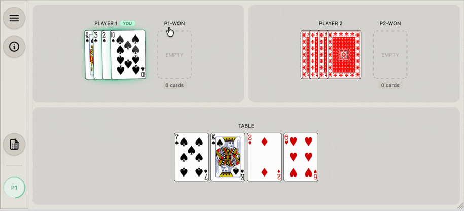

# AnyCard

AnyCard is a card game engine designed for implementing and playing almost any card game.

## Preview



## Quick Start

To get the project up and running locally, follow these steps:

1.  **Install dependencies** for the root, backend, and frontend:
    ```bash
    npm install
    npm install --prefix backend
    npm install --prefix frontend
    ```
2.  **Configure environment variables:** (Note: The default settings are a good starting point but make sure to adjust e.g. CORS settings, LLM configuration, and whatnot to conform to your setup.)

    ```bash
    cp backend/.env.example backend/.env
    cp frontend/.env.example frontend/.env
    ```

3.  **Start the development server:**
    ```bash
    npm run dev
    ```
4.  **Play the game:**
    Open your browser and navigate to `http://localhost:5173`.

## Note on View Transitions

The engine leverages the **browser's native CSS View Transition API** to animate card movements and state changes. These transitions are not merely "eye candy"—they are **essential for gameplay**.

By visually tracking the motion of cards as they move between the deck, players' hands, and the table, players can intuitively follow the flow of the game. Without these transitions, cards would simply "teleport" between states, making it difficult to maintain spatial awareness of the game's progress. In fact, in some cases the cards would even stay hidden if view transitions are not supported by the browser as player would not e.g. see the card being flipped face-up when it moves between piles.

Thus, a **modern browser** that supports the View Transitions API is required.

## Development & Disclaimer

This project was developed almost entirely through "vibe coding" techniques, utilizing various coding agents and LLMs. While very little manual code was written (though some manual fixes were applied), the project is driven by a clear intuition and vision of what I wanted to create.

**Important:** This project is **not production-ready**. Due to its experimental development nature, the codebase may contain security vulnerabilities. Specifically, authentication has **not** been implemented.

This is for **demo purposes only**. Please consult the `LICENSE.txt` file, which explicitly states that the software is provided without warranty of any kind.

## Background & Philosophy

As software developers, we often assume card games are simple or even naive examples of what software can do, but they actually offer a surprising depth of features—and they happen to serve as an excellent playground for **vibe coding**.

### Scope & Mission

AnyCard was designed to implement and play almost any card game, focusing on multiplayer classics such as Canasta, Bridge, and Gin Rummy. While the engine can support popular games like Poker and Blackjack, a primary motivation was to provide implementations for less common games than contributing to the oversaturation of existing clones.

The engine is strictly focused on **turn-based games**. It excludes real-time games (like Spit or Speed) and those requiring copyrighted or custom decks (like Uno). While the current focus is on multiplayer mechanics, it is likely capable of supporting solitaire games with minor adjustments.

### Aesthetics & Look-and-Feel

I have placed a strong emphasis on graphics and the overall "look and feel." Throughout development, I have tried to keep the aesthetics and gameplay as close as possible to the natural experience of playing with a physical deck.

- **High-Quality SVGs:** While many card game implementations exist, they often lack high-quality visuals. AnyCard uses high-quality SVG card sets sourced from the community—I am deeply grateful for these open-source and public-domain contributions—which work beautifully even on high-resolution mobile devices.
- **Mobile-First & Multi-Device:** Mobile support has been a first-class priority from day one. The layout is designed to be playable on small screens, but nothing prevents using a smart TV as a spectator overview while players use tablets or phones for their hands. Naturally, involved games like Bridge and Canasta benefit from bigger screens, but I have done my best to make them fully playable on mobile.
- **Fluid Animation:** The engine uses the CSS View Transition API to animate card movements, ensuring that players can intuitively follow the flow of the game as cards move between the deck, hands, and the table.

### Rule Fidelity & Reputable Sources

I have aimed to implement the games as faithfully as possible to their classical, most well-known rules, without "watering down" mechanics due to the constraints of a digital format.

- **Authoritative Sources:** My go-to reference has been [Pagat.com](https://www.pagat.com) (edited by John McLeod). I include links to the specific rules for each game implementation and am grateful to the authors who publish these rules freely.
- **Simplification & Constraints:** Some compromises were necessary for this prototype. Many games support a variable number of players, but since rules often change significantly based on player count (e.g., 2-player vs. 4-player Bridge), I have often fixed the number of players for specific implementations to keep the logic manageable. Adding configurable player counts and rule variations is a goal for the future.

### AI Opponents & LLM Integration

The engine passes the publicly visible game state, the rules, and basic strategy advice to a **Large Language Model (LLM)**, which then decides on a move. This approach works to an extent, but it has technical trade-offs:

- **Performance:** Local models may take 20–30 seconds per move in complex games, while cloud-based models are faster but incur usage costs. Smaller local models may offer lower latency, though their strategic depth varies; for example, `google/gemma-3-27b` performs reasonably, but I can't say it plays particularly well. Overall performance is highly dependent on prompt engineering, which remains an area for significant optimization.
- **Client-Side AI:** To avoid prohibitively expensive server costs (and the risks of storing user API keys server-side), the engine allows the **browser (client) to handle LLM requests directly**. This enables users to use their own API credits—with keys stored only in session storage—while ensuring privacy. This approach requires addressing CORS and mixed-content considerations for certain providers or local LLM runners like LM Studio. While connecting to a local LM Studio is straightforward for experimentation, please remember that this software is provided without warranty; refer to the license for more details.

### Project Status

The project is currently at a **demo level** what comes to the engine features. Also, while I aim for completeness and fidelity, many games themselves surely have bugs left and may not be fully playable.

## License & Copyright

This project is licensed under the **GNU Affero General Public License v3.0 (AGPL-3.0)**. See the `LICENSE.txt` file for the full text.

Copyright (C) 2025 JPH.

### Third-Party Licenses

AnyCard includes several third-party assets with their own licenses. We are grateful to the authors for making these available:

- **Playing Card Sets** (located in `frontend/public/cards/`):
  - **Atlasnye**: CC0 1.0 Universal by Dmitry Fomin.
  - **Brescia**: CC BY-SA 4.0 by ZZandro.
  - **Digital Design Labs**: LGPL 3.0 by Mike Hall & Chris Aguilar.
  - **SVG-cards**: LGPL-2.1 by htdebeer.
  - **Vector Playing Cards**: Public Domain / WTFPL by Byron Knoll and notpeter.
  - **Adrian Kennard**: CC0 1.0 Universal.
  - **David Bellot**: GNU LGPL v3.0 (Card back and Jokers used in several sets).

- **Game Rules**:
  - Many implementations are based on the rules documented at [Pagat.com](https://www.pagat.com), edited by John McLeod.

- **Software Dependencies**:
  - Standard libraries (React, Node.js, Express, Socket.io, LangChain, etc.) are used under their respective permissive licenses (MIT, Apache-2.0, etc.).
